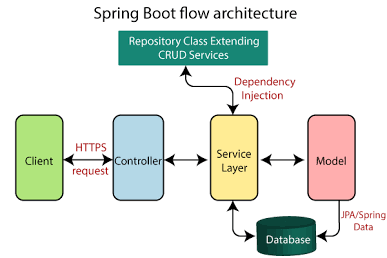
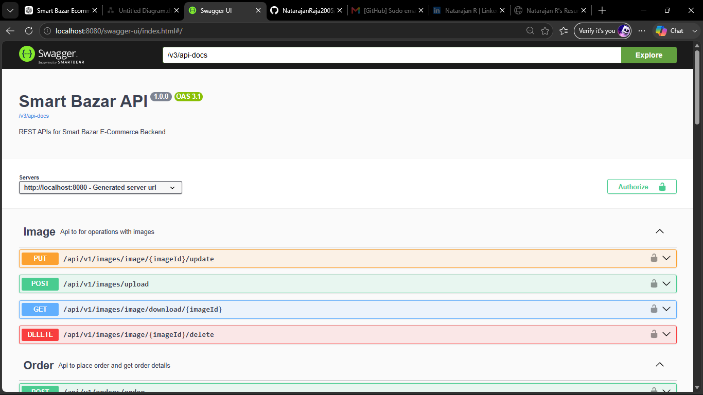

# Smart Bazar Backend

Production-ready E-Commerce Backend built using Spring Boot, Spring Security, JWT Authentication, Hibernate, MySQL, and RESTful APIs.

---

## Project Overview

Smart Bazar Backend is a production-style e-commerce backend application developed using Spring Boot. It provides secure RESTful APIs for managing products, categories, shopping carts, orders, user authentication, and image uploads.

The project follows a layered architecture using Controllers, Services, Repositories, and DTOs to ensure clean code, scalability, and maintainability. Authentication and authorization are implemented using Spring Security and JWT, while data persistence is handled using Spring Data JPA and MySQL.

This project was developed to strengthen backend development skills and demonstrate real-world Spring Boot application development practices.

---

## Features

###  Authentication
- User Login
- JWT Authentication
- Role-Based Authorization (ADMIN & USER)

###  Product Management
- Create Product
- Update Product
- Delete Product
- Retrieve Products

###  Category Management
- Create Category
- Update Category
- Delete Category
- Retrieve Categories

###  Shopping Cart
- Add Items to Cart
- Update Quantity
- Remove Items
- Clear Cart

###  Order Management
- Place Orders
- View Order History
- View Order Details

###  Additional Features
- Image Upload
- Request Validation
- Global Exception Handling
- Swagger API Documentation

---

##  Technology Stack

| Category | Technologies |
|----------|--------------|
| Language | Java 21 |
| Framework | Spring Boot |
| Security | Spring Security, JWT |
| ORM | Spring Data JPA, Hibernate |
| Database | MySQL |
| Build Tool | Maven |
| API Documentation | Swagger / OpenAPI |
| Testing | Postman |
| Version Control | Git & GitHub |


---

# System Architecture

The application follows a layered architecture to ensure separation of concerns, maintainability, and scalability.

                Client (Postman / Frontend)
                          │
                          ▼
                 Spring Security Filter
                          │
                          ▼
                   JWT Authentication
                          │
                          ▼
                     REST Controllers
                          │
                          ▼
                      Service Layer
                          │
                          ▼
                    Repository Layer
                          │
                          ▼
                         MySQL


---

#  Section 6 — Project Structure

```md
---

#  Project Structure

src
├── controller
├── service
│   └── impl
├── repository
├── entity
├── request
├── response
├── security
│   ├── jwt
│   ├── config
│   └── user
├── exception
├── config
└── SmartBazarApplication.java


---

# Section 7 — Database Design

```md
---

#  Database Design

The application uses **MySQL** as the relational database.

### Main Entities

- User
- Role
- Product
- Category
- Cart
- Cart Item
- Order
- Order Item
- Image

These entities are mapped using Spring Data JPA and Hibernate.

---

# JWT Authentication Flow

The application uses JWT (JSON Web Token) for stateless authentication.

Authentication Flow:

```text
User Login
      │
      ▼
AuthenticationManager
      │
      ▼
UserDetailsService
      │
      ▼
JWT Token Generated
      │
      ▼
Returned to Client
      │
      ▼
Client sends JWT in Authorization Header
      │
      ▼
JWT Filter validates Token
      │
      ▼
Protected API Access


---

#  Section 9 — API Documentation

```md
---

#  API Documentation

The project includes interactive API documentation using Swagger OpenAPI.

After starting the application, access Swagger UI at:

#  Getting Started

### Clone Repository

```bash

```

### Navigate

```bash
cd smart-bazar-backend
```

### Configure Database

Update `application.properties`

```properties
spring.datasource.url=###
spring.datasource.username=###
spring.datasource.password=###

jwt.secret=
```

### Build

```bash
mvn clean install
```

### Run

```bash
mvn spring-boot:run
```

Application starts on:

```text
http://localhost:8080
```

---

#  Future Enhancements

- Product Search
- Wishlist
- Coupon System
- Payment Gateway Integration
- Email Notifications
- Product Reviews
- Inventory Management
- Docker Support
- CI/CD Pipeline
- Redis Caching

---

#  Author

**Natarajan R**

Aspiring Java Backend Developer

- GitHub: https://github.com/NatarajanRaja2005
- LinkedIn: https://www.linkedin.com/in/natarajanraja2005/
- PortFolio: https://natarajanraja2005.github.io/Natarajanportfolio/

---

#  License

This project is licensed under the MIT License.

#  System Architecture

<p align="center">
    
</p>

---

#  JWT Authentication Flow

<p align="center">
    
</p>

---

#  Entity Relationship Diagram

<p align="center">
    
</p>

# API Documentation

The project includes interactive API documentation using Swagger OpenAPI.

<p align="center">
    
</p>
